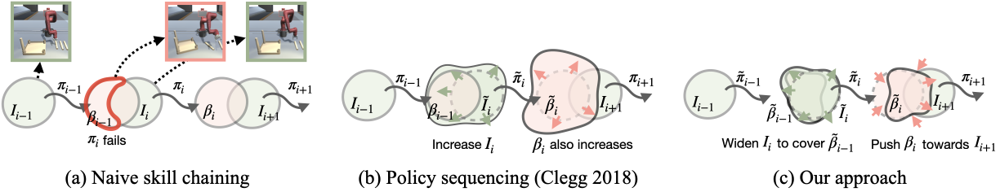
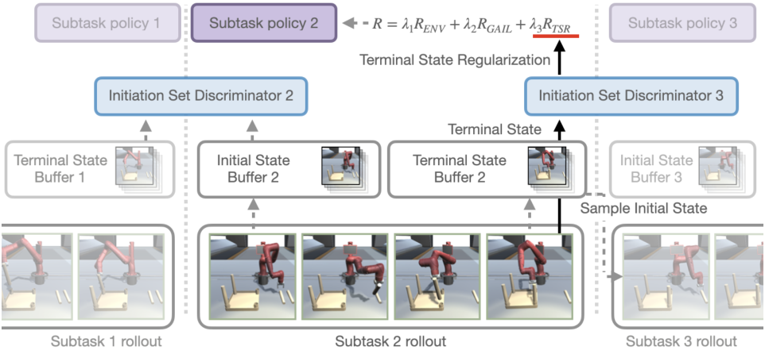
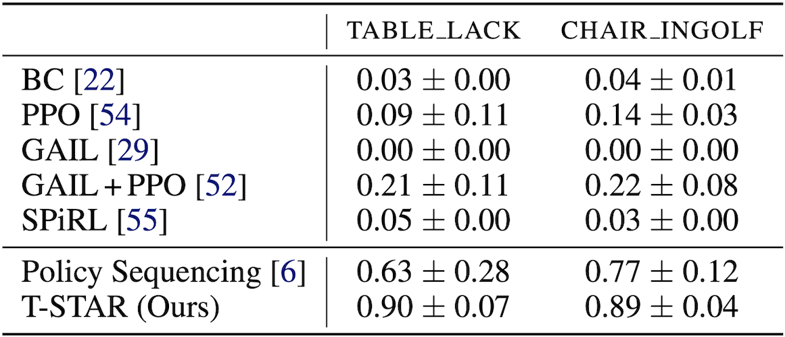

----

## Motivation

Our goal is to compose a long chain of skills to solve complex long-horizon tasks, <a href="https://clvrai.com/furniture" target="_blank">IKEA furniture assembly</a>. As demonstrated in <a href="https://clvrai.com/transition" target="_blank">prior work</a> on <a href="https://ckllab.stanford.edu/learning-dress-synthesizing-human-dressing-motion-deep-reinforcement-learning" target="_blank">skill</a> <a href="https://clvrai.com/coordination" target="_blank">composition</a>, naively sequencing skills often fails because the skills are not learned to be composed together and improving skills to cover all possible situations is computationally infeasible.

<div class="w3-row-padding">
    <br>
    
    <figcaption class="imgcaption">Illustration of skill chaining methods</figcaption>
</div>


More specifically, a skill fails when the previous skill ends at states unseen during its training, as illustrated in *(a) Naive skill chaining*. To successfully execute multiple skills in sequence, the terminal states of one skill (**termination set**) must lie on the **initiation set** of the subsequent skill. *(b) <a href="https://ckllab.stanford.edu/learning-dress-synthesizing-human-dressing-motion-deep-reinforcement-learning" target="_blank">Policy sequencing (Clegg et al. 2018)</a>* iteratively fine-tunes skills on the unseen initial states so that the skills can be smoothly executed. However, it quickly becomes infeasible as the larger initiation set often leads to an even larger termination set, which is cascaded along the chain of skills.
<br>

For example, while performing a skill, a robot can mess up the workplace by moving other objects away, which requires the following skill to deal with highly diverse configurations. To accomplish a task composed of multiple skills, it is desirable to keep the workplace organized during skill execution.


----


## Our method

Inspired by this intuition, we propose to regularize the terminal state distribution of one skill to be close to the initiation set of the following skill. By regularizing unbounded expansion of terminal state distributions, our *Terminal STAte Regularization (T-STAR)* can prevent excessively large initiation sets to be learned, and thus efficiently learn to chain a long sequence of skills. Our adversarial skill chaining framework alternates training of skills and initiation set discriminators that provide T-STAR.





----


## TABLE_LACK

<table style="width:100%; margin: auto; max-width: 1200px; table-layout: fixed;">
<tbody>
  <tr style="border-bottom: none;">
    <td style="text-align: center">
        <figcaption class="imgcaption">T-STAR (Ours)</figcaption>
    </td>
    <td style="text-align: center">
        <figcaption class="imgcaption">Policy Sequencing</figcaption>
    </td>
    <td style="text-align: center">
        <figcaption class="imgcaption">GAIL+PPO</figcaption>
    </td>
    <td style="text-align: center">
        <figcaption class="imgcaption">BC</figcaption>
    </td>
  </tr>
  <tr style="border-bottom: none;">
    <td style="text-align: center">
        <video height="auto" width="95%" controls autoplay loop muted>
            <source src="video/table_lack/ours1.mp4" type="video/mp4">>
        </video>
    </td>
    <td style="text-align: center">
        <video height="auto" width="95%" controls autoplay loop muted>
            <source src="video/table_lack/ps1.mp4">
        </video>
    </td>
    <td style="text-align: center">
        <video id="round" height="auto" width="95%" controls autoplay loop muted>
            <source src="video/table_lack/gailppo1.mp4">
        </video>
    </td>
    <td style="text-align: center">
        <video id="round" height="auto" width="95%" controls autoplay loop muted>
            <source src="video/table_lack/bc1.mp4">
        </video>
    </td>
  </tr>
  <tr style="border-bottom: none;">
    <td style="text-align: center">
        <video height="auto" width="95%" controls autoplay loop muted>
            <source src="video/table_lack/ours2.mp4" type="video/mp4">>
        </video>
    </td>
    <td style="text-align: center">
        <video height="auto" width="95%" controls autoplay loop muted>
            <source src="video/table_lack/ps2.mp4">
        </video>
    </td>
    <td style="text-align: center">
        <video id="round" height="auto" width="95%" controls autoplay loop muted>
            <source src="video/table_lack/gailppo2.mp4">
        </video>
    </td>
    <td style="text-align: center">
        <video id="round" height="auto" width="95%" controls autoplay loop muted>
            <source src="video/table_lack/bc2.mp4">
        </video>
    </td>
  </tr>
</tbody>
</table>


----


## CHAIR_INGOLF

<table style="width:100%; margin: auto; max-width: 1200px; table-layout: fixed;">
<tbody>
  <tr style="border-bottom: none;">
    <td style="text-align: center">
        <figcaption class="imgcaption">T-STAR (Ours)</figcaption>
    </td>
    <td style="text-align: center">
        <figcaption class="imgcaption">Policy Sequencing</figcaption>
    </td>
    <td style="text-align: center">
        <figcaption class="imgcaption">GAIL+PPO</figcaption>
    </td>
    <td style="text-align: center">
        <figcaption class="imgcaption">BC</figcaption>
    </td>
  </tr>
  <tr style="border-bottom: none;">
    <td style="text-align: center">
        <video height="auto" width="95%" controls autoplay loop muted>
            <source src="video/chair_ingolf/ours1.mp4" type="video/mp4">>
        </video>
    </td>
    <td style="text-align: center">
        <video height="auto" width="95%" controls autoplay loop muted>
            <source src="video/chair_ingolf/ps1.mp4">
        </video>
    </td>
    <td style="text-align: center">
        <video id="round" height="auto" width="95%" controls autoplay loop muted>
            <source src="video/chair_ingolf/gailppo1.mp4">
        </video>
    </td>
    <td style="text-align: center">
        <video id="round" height="auto" width="95%" controls autoplay loop muted>
            <source src="video/chair_ingolf/bc1.mp4">
        </video>
    </td>
  </tr>
  <tr style="border-bottom: none;">
    <td style="text-align: center">
        <video height="auto" width="95%" controls autoplay loop muted>
            <source src="video/chair_ingolf/ours2.mp4" type="video/mp4">>
        </video>
    </td>
    <td style="text-align: center">
        <video height="auto" width="95%" controls autoplay loop muted>
            <source src="video/chair_ingolf/ps2.mp4">
        </video>
    </td>
    <td style="text-align: center">
        <video id="round" height="auto" width="95%" controls autoplay loop muted>
            <source src="video/chair_ingolf/gailppo2.mp4">
        </video>
    </td>
    <td style="text-align: center">
        <video id="round" height="auto" width="95%" controls autoplay loop muted>
            <source src="video/chair_ingolf/bc2.mp4">
        </video>
    </td>
  </tr>
</tbody>
</table>


----


## Quantitative Results

<!--  -->
<div class="w3-row-padding">
    
    <figcaption class="imgcaption">Success rates</figcaption>
</div>


----


## Citation
```
@inproceedings{lee2021t-star,
  title={Adversarial Skill Chaining for Long-Horizon Robot Manipulation via Terminal State Regularization},
  author={Youngwoon Lee and Joseph J. Lim and Anima Anandkumar and Yuke Zhu},
  booktitle={Conference on Robot Learning},
  year={2021}
}
```
<br>
